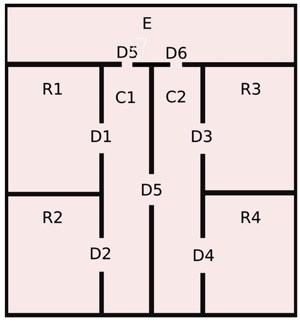
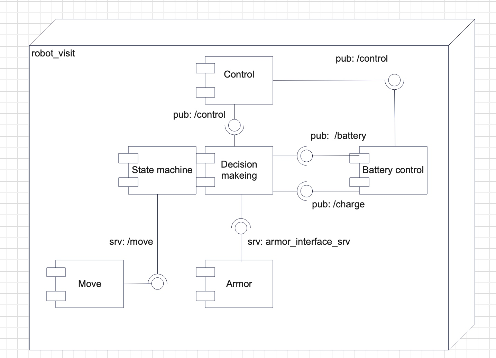
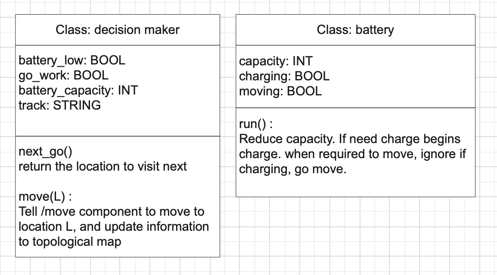
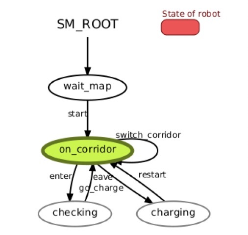
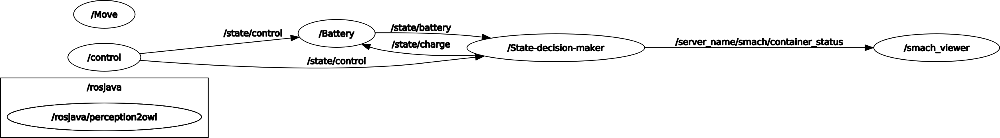
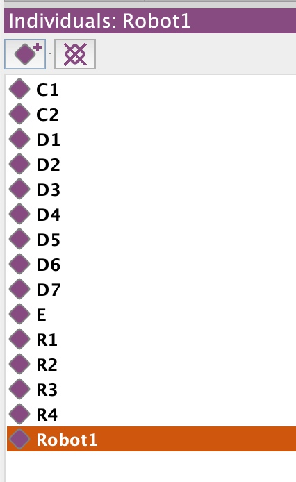
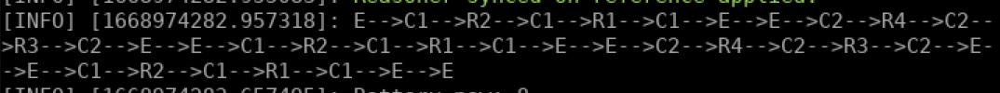

# Author:
By Zhouyang Hong. 
Student id: S5197402    
email: qq765490023@gmail.com

# Introduction
### The Doxygen documentation can be found here: html/index.html

This is a course project for Experimental Robotics Laboratry, using Smach (For the implementation of state-machine), ARMOR(For accessing Ontology using python), and ROS to simulate a robot visiting different rooms navigated by a topological map.

Above is the topological map used for this assignment. To be noticed D5 of room E is modified to D7.

# Architecture

Above is the architecture used for the whole project. There are 5 nodes in total which are as below. 

### state-decision-maker:
state-decision-maker consists of state-machine and decision-maker those 2 parts. Conceptually they are different, the decision-maker is used as a parameter for the state-machine. 
decision-maker can tell state-machine what decision to make for the next step, and also communicate with Move(which is to simulate the motion of robot), update topological locations. 
However, those are just functions provided, state-machine will decide whether and when to call them. 

### control: 
Control the motion of the robot by simply inputting 'go' or 'stop'
### move:
Now it will just sleep for a rand period of time, the final control of real motion of the robot should be put here.
### armor:
Armor is just a service ran used to support rospy to interact with Ontology, code for doing such interaction is inside "state-decision-maker"
### battery control:
This node is used for managing the battery, it will publish the current capacity of the battery to decision-maker to support decision-making. When robot needs charge and is in the right location, here is what responsible for charging.

Above are the main classes for the implementation. 
Through next_go, the location the robot can go and also should go will be returned and strategies, batteries, control-state and ontology information are considered to make such a decision. Through move(L), robot will call the move to move to the target location, after arriving goal location, current location will be updated to ontology.

State-machine

Above is the design of the state of the robot. In the beginning, the robot waits for the starting command, battery information, and also map information. checking represents the robot inside the rooms. The place to charge the robot is considered as on_corridor.

Rqt_graph:

This is a RQT graph of the implementation.

ABOX

Inside the above picture are the objects relevant to the design of ontology.

# How to run
    
    go to the workspace.
    cd src
    git clone https://github.com/EmaroLab/armor
    git clone https://github.com/EmaroLab/armor_py_api.git
    export PYTHONPATH=$PYTHONPATH:<path/to/armor_py_api>/scripts/armor_api/
    Where <path/to/armor_py_api> should match with you actual installation path.
    
    cd ..
    catkin_make
    open a tab run: roscore
    open new tab run: rosrun smach_viewer smach_viewer.py 
    open new tab run: rosrun armor execute it.emarolab.armor.ARMORMainService
    open new tab run: roslaunch robot_visit robot_visit.launch
    open new window run: rosrun robot_visit control.py
    
    go to the tab of "control.py" and input: go
    Now you shall see the robot moving around, If you want to stop it, instead of inputting go, input stop
    

# Result

Result:

 
State-machine

# Working hypothesis and environment:

## environment: 
ubuntu 20.04, ROS-neotic, python 3.8.5.

## features
    1. Constantly visiting rooms while the nearest urgent rooms have the highest priority.  
    2. The robot tends to visit the room that it didn't visit for the longest time while under the condition that no room is urgent.
    3. Robot will go back to charge itself when the battery gets low, if E is not yet reachable, Robot tends to go to other corridors until E is reachable.

## limtations
    1. Do not support real navigation so far, since it is just a topological map now.
    2. The moving process can't be preempted.
    3. Path of the robot can not be planned manually.
## Possible technical improvements

1. A proper threshold for reckoning battery_low is not decided. If the remaining battery is able to reach the place to charge and better make full use of the battery are things to be considered.
2. Automatically recognize rooms and construct the topological map is a point to improve.

# Reference
The design of ontology is based on the following example.
https://github.com/buoncubi/topological_map 
    
The design of the architecture referred to the following project:
https://github.com/buoncubi/arch_skeleton

